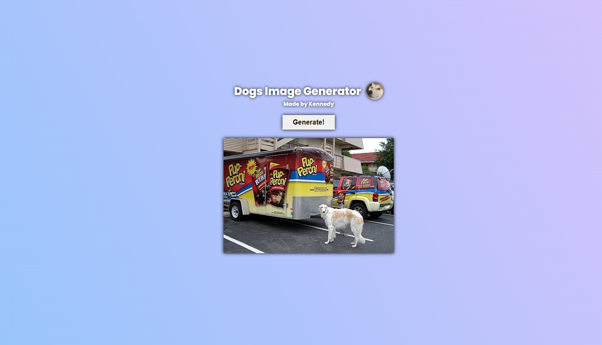

<h1 align=center>Dogs Image Generator </h1>

<h3 align=center>Technologies </h3>

  
  

 

#### 🚀 Used <a href="https://dog.ceo/dog-api/">Dogs Api</a>

 

  <h4><a href="">💻 Preview Page</a></h4>
  

